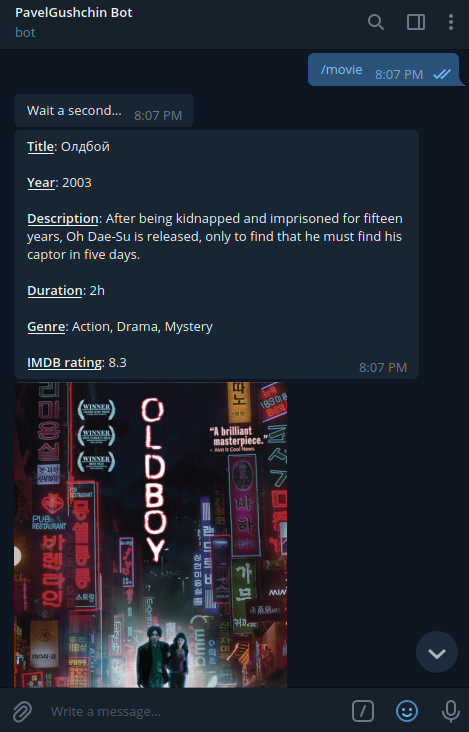
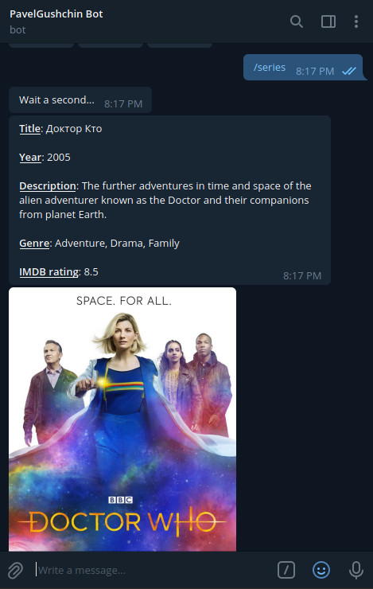

# Movie Adviser bot for Telegram

## Purpose of this bot
If you don't know what movie to watch, you can ask the bot, and it will advise you an interesting movie (or TV series) to watch.

## How does bot work?
The bot parses "Top 250 Movies" (or "Top 250 TV Series") from IMDB site, randomly chooses one movie from there and gives it to you as a recommendation. 

## What commands does bot understand?
```text
/start - Say "Hello"
/movie - Advise an interesting movie
/series - Advise an interesting TV series
/help - Show help message
```

## Screenshots
### "/movie" command


### "/series" command


## How to run this bot?
First, you need to create a new bot in Telegram and receive an API Token for it.

To do that, you have to talk to BotFather and follow a few simple steps. Google it.

Then you need to paste your API Token to "secret_token.py" file:

```python
# "secret_token.py" file
TOKEN = 'YOUR_API_TOKEN'
```

After that, clone this repository:

```shell
git clone https://github.com/PavelGushchin/telegram_bot.git
```

Install the required packages:

```python
pip3 install python-telegram-bot
pip3 install beautifulsoup4
pip3 install requests
pip3 install lxml
```

That's all! Now you can run the bot:
```shell
python3 main.py
```